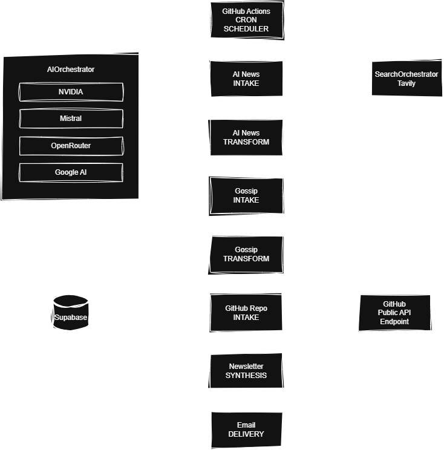

# Automated AI Newsletter

## Setup

**Clone the Repo**
In your Command Prompt or Terminal navigate to the directory you want to clone the repository code into.\
Enter the following:
1. `git clone https://github.com/Flowers70/automated_ai_newsletter.git`
2. `cd automated_ai_newsletter`
3. `pip install -r requirements.txt`

**Environment Variables**
| Key | Description |
| --- | ----------- |
| Tavily_DEV | [Tavily](tavily.com) is a search engine | 
| Google_AI_Key | [Google AI](https://ai.google.dev/gemini-api/docs) is an AI |
| MISTRAL_API_KEY | [Mistral AI](https://docs.mistral.ai/admin/identity-access/api-keys) is an AI |
| OPENROUTER | [OpenRouter](https://openrouter.ai/) is an AI |
| NVIDIA_DEV | [NVIDIA](https://build.nvidia.com/settings/api-keys) is an AI |
| EMAIL_PASS | An app password for programmatic access to your email |
| EMAIL_USER | Your email or username |
| EMAIL_RECIPIENTS | The list of emails the newsletter will be sent to |

Create an .env file in the root of the project and create and/or enter the corresponding secret for each of the above environement variables. Be sure to use the key above as the variable name. If using [GitHub Actions](https://docs.github.com/en/actions/how-tos/write-workflows/choose-what-workflows-do/use-secrets), create respository secrets.\
**WARNING:** Ensure that you keep these secret and don't upload them to your GitHub repo (use .gitignore). 🤫

**Running Locally**
In your Command Prompt or Terminal ensure you are in the main directory of the automated_ai_newsletter.

Enter `python newsletter_generator.py`

This will generate a newsletter, email it to the recipients stored in the EMAIL_RECIPIENTS variable, and archive the edition in the 'newsletter_archive' folder.

**Running Automatically (GitHub Actions)**
The GitHub workflow file is stored in the '.github/worflows' folder in the main directory of this project and is titled 'newsletter.yml'. Within this yaml file is the cron schedule:

```
schedule:
    - cron: "30 3 * * *" # Time scheduled to run
```

By default this is set to run at 3:30 am (UTC) daily. Once this yaml file is uploaded to GitHub as is it will create a corresponding GitHub Action automatically. You can trigger this automatically by navigating to the Actions tab in your repository.

To add the secrets to your GitHub repository follow these [instructions](https://docs.github.com/en/actions/how-tos/write-workflows/choose-what-workflows-do/use-secrets).

## Architecture
This project follows a linear pipeline architecture, designed to run end-to-end every morning without human intervention. Each stage collects, transforms, and enriches data:



### 1. AI News | Intake

Retrieves daily AI related articles using a search provider.\
Each result includes:
- Title
- url
- Content (summary of page contents)
- Relevance
- Publication Date
This stage provides the raw materials for the newsletter's "Big Story" and "Frontier Watch" sections.

Output: A list of AI-related articles published in the past day.

### 2. AI News | Transform

Processes and filters the raw articles:
- Classifies each article as news, analysis, or noise
- Discards noise
- Discards articles with insufficient relevant articles
- Normalizes each article, cleaning the scraped data using NLP (Natural Language Processing)
- Condenses each article into a summary for the final newsletter synthesis
- Extracts key information (e.g. title) for downstream synthesis
This ensures only corroborated and consequential articles enter the final newsletter.

Output: A vetted list of meaningful AI articles.

### 3. Gossip | Intake

Retrieves gossip from X and Reddit related to the vetted articles using a search provider.\
Each result includes:
- Title
- url
- Content (summary of page contents)
This stage provides the raw materials for the newsletter's "The Street Says" section.

Output: A dictionary of lists containing the specific pages of gossip for each social media platform.

### 4. Gossip | Transform

Processes the raw gossip capturing:
- Gossip
- Sentiment
- Drama
This provides a short summary concerning the gossip's sentiment for the final newsletter.

Output: Short summaries containing the overall sentiment of gossip for each social media platform.

### 5. GitHub | Intake

Fetches trending AI-related repositories from GitHub's public endpoint.\
This includes:
- Name
- url
- Description
- Homepage
- Stars
- Programming language
This stage obtains the raw data needed structured in a dictionary for the "Repo of the Day" section.

Output: A dictionary containing metadata on a meaningful AI-related GitHub repository.

### 6. Newsletter | Synthesis

Combines all the processed inputs into a single editorial markdown formatted newsletter.
A structured prompt generates the newsletter's five sections:
- The Big Story
  - The overarching story that emerges from the inputs
- Frontier Watch
  - The vetted news articles
- The Street Says
  - The gossip concerning the news on X and Reddit
- Repo of the Day
  - An AI-related GitHub repository trending amongst developers
- Two Steps Ahead
  - An educated guess on what this news implies for the future
This layer ensures each section answers *why* it matters, provides forward-looking insight, and is written with non-technical readers in mind. 

Output: A markdown formatted newsletter.

### 7. Email | Output

Transforms the markdown into html and delivers it through email.\
This is automatically triggered by the automated workflow.

Output: A daily edition delivered by email.

## Design Decisions

### Pipeline Structure
Intake > Transform > Synthesis > Output

Rather than extract all the necessary information and then transform and synthesize the information into an output I chose to process the intake and transformation of each data source sequentially before synthesizing the final results to 

### Data Quality & Filtering

### AI-Driven Synthesis

### Automation & Scheduling

### Storage & Persistence

### Resilience & Error Handling

